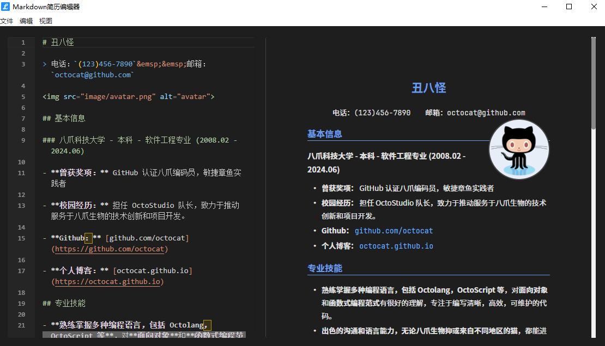

# 在线简历编辑器

一个优雅的 Markdown 简历编辑器，基于 Electron 构建。支持实时预览、PDF导出、主题切换等功能。同时提供 Web 版本，支持 PWA 离线使用。



## 🌐 在线使用

访问 [在线简历编辑器](https://your-domain.com) 即可开始使用。

### PWA 支持

本应用支持 PWA（渐进式 Web 应用）特性：
- 📱 可添加到主屏幕，实现原生应用般的体验
- 🔄 支持离线访问和自动更新
- 🚀 快速加载和响应
- 💾 本地数据存储

## ✨ 功能特点

- 📝 Markdown 实时编辑与预览
- 🔄 编辑器与预览区域同步滚动
- 📱 响应式布局设计
- 🌓 支持明暗主题切换
- 🖼️ 支持头像图片设置
- 📄 一键导出 PDF
- 💾 自动保存内容
- ⌨️ Monaco Editor 强大的编辑体验
- 🌍 支持离线使用
- 📊 SEO 优化

## 🚀 快速开始

### 环境要求

- Node.js >= 14.0.0
- npm >= 6.0.0

### 安装

```bash
# 克隆项目
git clone https://github.com/your-username/lapis-cv.git

# 进入项目目录
cd lapis-cv

# 安装依赖
npm install
```

### 开发

```bash
# 启动开发模式
npm run dev
```

### 构建

```bash
# 构建应用
npm run dist
```

## 🎯 使用指南

1. **编辑简历**
   - 左侧为 Markdown 编辑区
   - 右侧为实时预览区
   - 支持标准 Markdown 语法

2. **设置头像**
   - 将头像图片放入 `image` 目录
   - 在 Markdown 中使用 `` 引用

3. **导出 PDF**
   - 点击菜单栏的"文件 -> 导出PDF"
   - 或使用快捷键 `Ctrl/Cmd + E`

4. **切换主题**
   - 点击菜单栏的"视图 -> 切换主题"
   - 或使用快捷键（见快捷键列表）

## ⌨️ 快捷键

- `Ctrl/Cmd + S`: 保存文档
- `Ctrl/Cmd + E`: 导出 PDF
- `Ctrl/Cmd + R`: 刷新
- `Ctrl/Cmd + +`: 放大
- `Ctrl/Cmd + -`: 缩小
- `Ctrl/Cmd + 0`: 重置缩放

## 🔧 技术栈

- 前端框架：Electron (桌面版) / 原生 Web (在线版)
- 编辑器：Monaco Editor
- Markdown 解析：Marked.js
- PDF 导出：html2pdf.js
- PWA 支持：Service Worker
- 图标：Font Awesome
- 主题：自定义 CSS 变量

## 💻 部署说明

### Web 版本部署

1. 准备环境：
   ```bash
   # 安装依赖
   npm install
   
   # 构建 Web 版本
   npm run build:web
   ```

2. 部署到服务器：
   - 将 `dist/web` 目录下的文件部署到您的 Web 服务器
   - 确保服务器配置了正确的 MIME 类型
   - 建议启用 HTTPS 以支持 PWA 功能

3. 配置说明：
   - 修改 `site.webmanifest` 中的相关信息
   - 更新 `index.html` 中的 meta 标签
   - 配置适当的缓存策略

## 📝 模板说明

默认提供了一个基础的简历模板，包含以下部分：

- 基本信息
- 教育背景
- 工作经验
- 专业技能
- 项目经历

您可以根据需要自由修改模板内容。

### 数据存储

- Web 版本使用 LocalStorage 存储编辑内容
- 支持自动保存和恢复
- 可导出数据备份

## 🤝 贡献指南

欢迎提交 Issue 和 Pull Request。在提交 PR 之前，请确保：

1. 更新了相关的文档说明
2. 添加了必要的测试用例
3. 通过了所有的测试
4. 符合代码规范

## 🔍 浏览器支持

- Chrome >= 80
- Firefox >= 75
- Safari >= 13
- Edge >= 80

## 📄 开源协议

本项目基于 [MIT](LICENSE) 协议开源。 